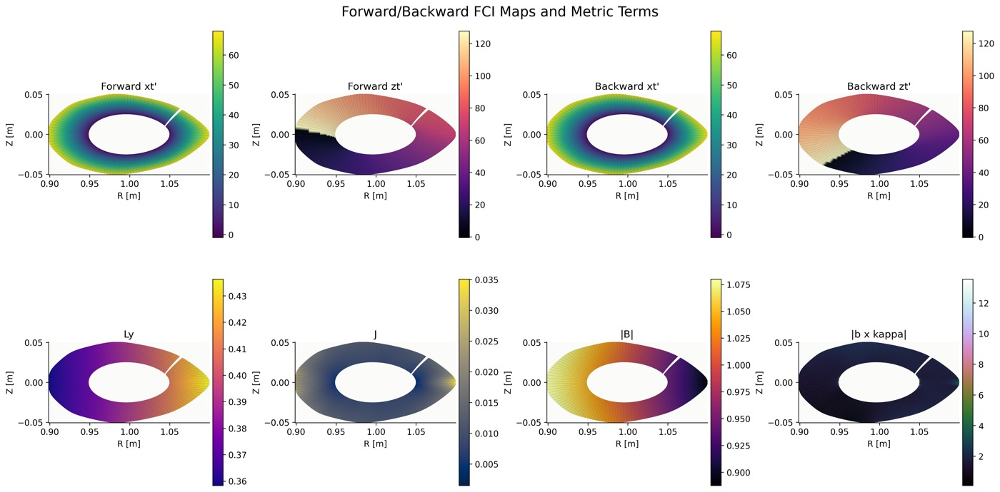
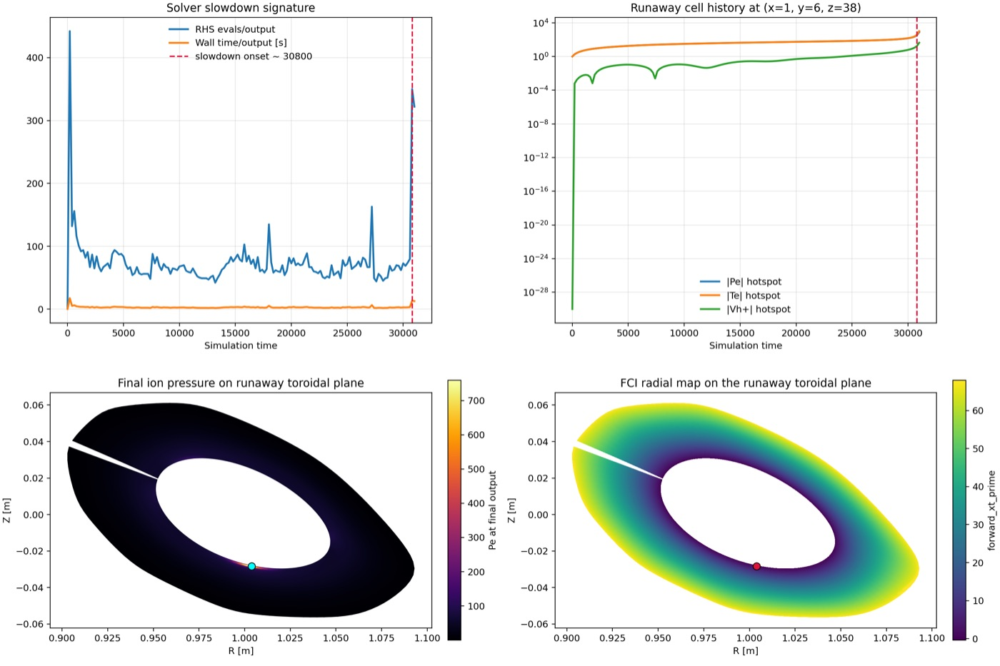

# bsting_files

This repository is a small, shareable bundle of the main scripts, runtime input, and lightweight companion files used for the BSTING-style Dommaschk grid and visualization workflow.

It is meant to be easy to browse and easy to reuse. The large simulation outputs, executables, and most generated artifacts are intentionally not included.

The figures and movies below were regenerated from the current stabilized local stellarator workflow.

<p align="center">
  
  
</p>

<p align="center">
  <video src="te_3d_pyvista.mp4" controls muted playsinline width="49%"></video>
  <video src="panel_movies.mp4" controls muted playsinline width="49%"></video>
</p>

Direct video links: [te_3d_pyvista.mp4](te_3d_pyvista.mp4) and [panel_movies.mp4](panel_movies.mp4)

## Quick layout

```text
bsting_files/
|-- README.md
|-- generate_grid.py
|-- panel_movies.py
|-- panel_movies.mp4
|-- visualize_temp_3d_pyvista.py
|-- te_3d_pyvista.mp4
|-- docs/
|   `-- assets/
|       |-- fci_maps_overview.jpg
|       |-- hermes_stall_diagnostics.jpg
|       `-- ...
`-- run_stellarator/
    |-- create_dommaschk_grid.py
    |-- data/
    |   `-- BOUT.inp
    `-- paraview_exports/
        |-- traced_field_lines_middle.vtm
        |-- traced_field_lines_outer.vtm
        |-- traced_movie_surfaces.vtm
        `-- traced_movie_surfaces_debug_fixed.png
```

## Requirements

Exact Python package versions used in the local environment for the plotting and visualization scripts:

- `numpy==2.3.4`
- `matplotlib==3.8.4`
- `scipy==1.16.0`
- `tqdm==4.66.4`
- `pyvista==0.46.4`
- `boututils==0.2.1`

Local source dependencies used by the shared scripts:

- `generate_grid.py` from this repository
- `zoidberg` modules from a local source checkout next to the original working repository

Optional system tool:

- `ffmpeg` if you want to write MP4 files from the plotting workflow

## What this repository is for

Use this repository if you want to:

- inspect the grid-generation and visualization scripts
- see the Hermes input used for the stellarator run setup
- open the main traced-surface ParaView exports
- view the small movie outputs that were generated from this setup

This repository is not intended to be a complete, ready-to-run Hermes case by itself. The heavy simulation outputs and binaries were left out on purpose.

## Repository contents

### Main scripts

- `generate_grid.py`
  Builds the Dommaschk grid support used by the rest of the workflow.

- `run_stellarator/create_dommaschk_grid.py`
  Regenerates the stellarator grid, creates diagnostic figures, and writes selected ParaView exports.

- `visualize_temp_3d_pyvista.py`
  Builds the traced magnetic-field-surface movie and exports the traced surfaces and field lines for ParaView.

- `panel_movies.py`
  Produces the panel movie from the available simulation fields.

### Input file

- `run_stellarator/data/BOUT.inp`
  Main Hermes runtime input used for this case.

### Included companion outputs

- `panel_movies.mp4`
  Small panel movie generated from the run outputs.

- `te_3d_pyvista.mp4`
  Small 3D PyVista movie showing temperature on traced magnetic surfaces.

- `docs/assets/fci_maps_overview.jpg`
  Compact grid and FCI-map diagnostic figure regenerated from the repaired local grid workflow.

- `docs/assets/hermes_stall_diagnostics.jpg`
  Compact stall-analysis figure showing the late-time boundary-adjacent runaway signature.

- `run_stellarator/paraview_exports/traced_movie_surfaces.vtm`
  Main traced-surface export for ParaView.

- `run_stellarator/paraview_exports/traced_field_lines_middle.vtm`
  Field-line export for the middle traced surface.

- `run_stellarator/paraview_exports/traced_field_lines_outer.vtm`
  Field-line export for the outer traced surface.

- `run_stellarator/paraview_exports/traced_movie_surfaces_debug_fixed.png`
  Small screenshot used to verify the corrected traced-surface seam geometry.

## Typical workflow

If you want to understand the files in a sensible order, use this sequence:

1. Start with `run_stellarator/data/BOUT.inp` to see the simulation setup.
2. Read `run_stellarator/create_dommaschk_grid.py` to understand how the grid and diagnostic exports are produced.
3. Read `visualize_temp_3d_pyvista.py` to understand how the traced-surface movie and ParaView outputs are constructed.
4. Read `panel_movies.py` to see how the panel-style movie is assembled.
5. Open the included `.vtm` files in ParaView if you want to inspect the geometry interactively.
6. Watch the included `.mp4` files if you only want the final lightweight outputs.

## How to use the ParaView files

Open these files directly in ParaView:

- `run_stellarator/paraview_exports/traced_movie_surfaces.vtm`
- `run_stellarator/paraview_exports/traced_field_lines_middle.vtm`
- `run_stellarator/paraview_exports/traced_field_lines_outer.vtm`

Suggested use:

- load `traced_movie_surfaces.vtm` to inspect the traced surface geometry
- load one or both `traced_field_lines_*.vtm` files to overlay the traced lines on the corresponding surfaces
- color by `B` or one of the exported `*_last` arrays when available

## What is intentionally excluded

The following were not committed here:

- Hermes executables and build directories
- simulation dumps, restart files, logs, and large NetCDF outputs
- large figures and movies above roughly 1 MB
- most ParaView exports that were intermediate, redundant, or too bulky

This keeps the repository small and focused on the user-facing pieces.

## Reproducing results

This repository contains the scripts and one main input file, but not the full heavy runtime environment. To reproduce everything from scratch you would still need:

- a working Hermes/BOUT++ build
- the required Python environment for the plotting scripts
- the omitted simulation output files, or a fresh rerun that regenerates them

In other words, this repository is best treated as a compact companion package rather than a complete archival snapshot.

## Notes

All files here were copied from a larger local workspace and reduced to the minimum useful set for sharing.
