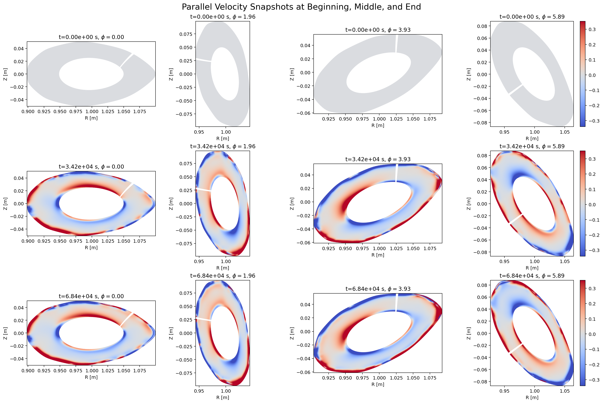
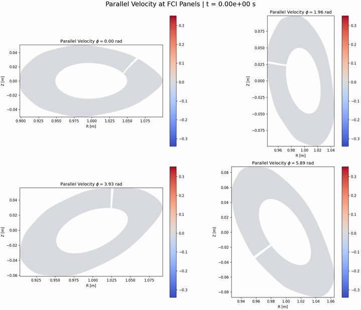
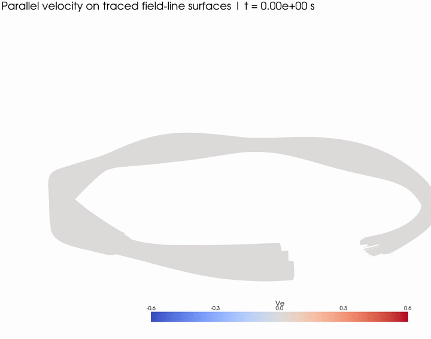
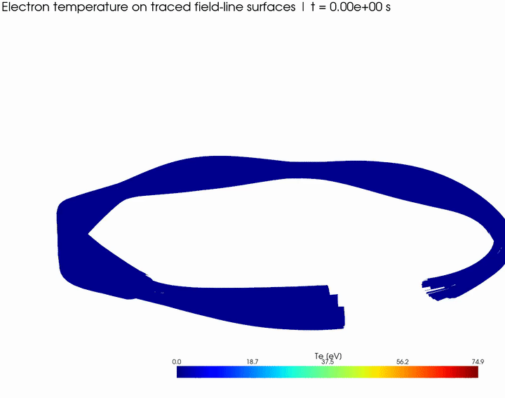

# bsting_files

This repository is the single working tree for the BSTING Dommaschk stellarator workflow: the runnable case, the postprocessing scripts, the review media, and the source dependencies needed to rebuild or inspect the setup.

The intent is simple:

- keep one clean place to run Hermes and regenerate diagnostics
- keep the large local outputs available for review and iteration
- keep the GitHub repository readable by excluding dumps, restart files, logs, and other heavy temporary artifacts

## Abstract

At a high level, this repository does three things:

1. defines the stellarator run setup in `run_stellarator/`
2. brings in Hermes-3 and the patched Zoidberg fork as submodules in `external/`
3. turns the latest run outputs into review-friendly figures, panel movies, traced-surface movies, and ParaView exports through the scripts in `plot/`

If you only need to understand how to use the repository, read the workflow below and then look at the images and movie previews.

## Typical Workflow

1. Update or rebuild the code in `external/hermes-3/` if needed.
2. Rebuild the grid with `run_stellarator/build_dommaschk_grid.py`.
3. Run Hermes from `run_stellarator/`.
4. Regenerate panels, movies, and ParaView exports with the scripts in `plot/`.
5. Review the outputs locally, then commit only the scripts, selected small assets, and submodule pointers.

## Visual Overview

<p align="center">
  
</p>

<p align="center">
  <a href="plot/outputs/parallel_velocity_panel_movie.mp4">
    
  </a>
  <a href="plot/outputs/parallel_velocity_traced_surface_movie.mp4">
    
  </a>
  <a href="plot/outputs/temperature_traced_surface_movie.mp4">
    
  </a>
</p>

## What The Repository Contains

The repository is organized around three user-facing areas.

- `run_stellarator/`
  The runnable case: inputs, grid-generation code, diagnostics, local run data, and ParaView entry files.

- `plot/`
  The postprocessing layer: scripts that read the latest available run data and turn it into review media.

- `external/`
  The source dependencies: Hermes-3 and the patched Zoidberg fork as submodules.

## Code And Submodules

### External source trees

- `external/hermes-3/`
  Hermes-3 source tree as a git submodule on branch `fci`.

- `external/zoidberg/`
  Zoidberg source tree as a git submodule on branch `fix/fci-boundary-hole-repair`.

These are part of the local workflow, but only their submodule pointers are tracked in the main repository.

### Run and analysis scripts

- `run_stellarator/build_dommaschk_grid.py`
  Rebuilds `run_stellarator/data/Dommaschk.fci.nc` with the targeted `x=1` boundary-trace repair.

- `run_stellarator/diagnose_hermes_stall.py`
  Reads the latest available dump source and helps inspect late-time solver behavior.

- `run_stellarator/dommaschk_grid_utils.py`
  Shared Dommaschk grid helper code used by the grid builder.

- `run_stellarator/BOUT.inp`
  Top-level Hermes input for direct launches from `run_stellarator/`.

- `run_stellarator/data/BOUT.inp`
  Mirrored case input inside the data directory.

### Plot scripts

- `plot/render_parallel_velocity_panels.py`
  Builds the panel movie and the panel snapshot figure from the latest available dumps.

- `plot/render_parallel_velocity_surfaces.py`
  Builds the parallel-velocity traced-surface movie and updates the corresponding ParaView exports.

- `plot/render_temperature_surfaces.py`
  Builds the temperature traced-surface movie using the same inner/outer traced-surface workflow, but writes separate temperature-specific review outputs.

All three scripts resolve paths relative to the repository root and prefer MPI shard dumps when they are newer than any combined dump.

## Structure

```text
bsting_files/
|-- docs/
|   `-- assets/
|-- external/
|   |-- hermes-3/
|   `-- zoidberg/
|-- plot/
|   |-- outputs/
|   |-- render_parallel_velocity_panels.py
|   |-- render_parallel_velocity_surfaces.py
|   `-- render_temperature_surfaces.py
`-- run_stellarator/
    |-- BOUT.inp
    |-- build_dommaschk_grid.py
    |-- diagnose_hermes_stall.py
    |-- dommaschk_grid_utils.py
    |-- data/
    `-- paraview_exports/
```

## Review Outputs

The main local review outputs are:

- `plot/outputs/parallel_velocity_panel_movie.mp4`
- `plot/outputs/parallel_velocity_panel_snapshots.png`
- `plot/outputs/parallel_velocity_traced_surface_movie.mp4`
- `plot/outputs/temperature_traced_surface_movie.mp4`
- `run_stellarator/paraview_exports/traced_movie_surfaces.vtm`
- `run_stellarator/paraview_exports/traced_field_lines_middle.vtm`
- `run_stellarator/paraview_exports/traced_field_lines_outer.vtm`

Temperature-specific ParaView exports are also produced locally when needed.

## Local Versus Tracked Files

Tracked in git:

- scripts and input files
- small review assets in `docs/assets/`
- selected ParaView `.vtm` entry files used for review
- README documentation
- submodule pointers for Hermes-3 and Zoidberg

Kept local only:

- `plot/outputs/*.mp4`
- `plot/outputs/*.png`
- `run_stellarator/data/BOUT.dmp*.nc`
- `run_stellarator/data/BOUT.restart*.nc`
- `run_stellarator/data/BOUT.log.*`
- `run_stellarator/data/BOUT.settings`
- `.BOUT.pid.*`
- temperature-specific ParaView exports and all generated ParaView sidecar directories
- submodule build artifacts and other temporary compilation files

## More Technical Notes

Two details matter for reproducing the current media and behavior:

- the grid build uses the repaired Dommaschk map workflow with the targeted `x=1` fix
- the plotting scripts select the newest available run data automatically, preferring the MPI shard dumps in `run_stellarator/data/`

The older technical reference figures are still kept in `docs/assets/` for deeper review, including the FCI map overview and the earlier stall-diagnostics figure.
