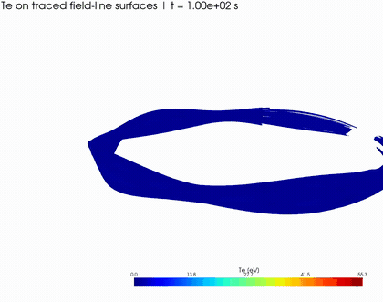
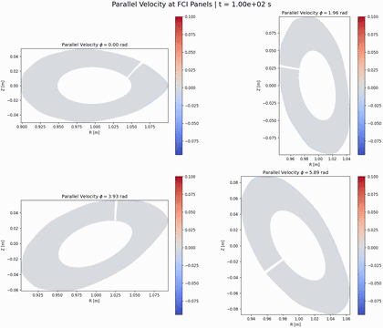

# bsting_files

This repository is now the single working tree for the BSTING Dommaschk stellarator setup.

Locally, it keeps the simulation case, plotting scripts, ParaView exports, movies, figures, and the external source trees needed to rebuild or inspect the workflow. In git, large run outputs and temporary build artifacts stay untracked so the GitHub repository remains reviewable.

## Layout

```text
bsting_files/
|-- docs/
|   `-- assets/
|-- external/
|   |-- hermes-3/        # git submodule, branch: fci
|   `-- zoidberg/        # git submodule, branch: fix/fci-boundary-hole-repair
|-- plot/
|   |-- outputs/
|   |   |-- parallel_velocity_panel_movie.mp4
|   |   `-- parallel_velocity_traced_surface_movie.mp4
|   |-- render_parallel_velocity_panels.py
|   |-- render_temperature_surfaces.py
|   `-- render_parallel_velocity_surfaces.py
`-- run_stellarator/
    |-- BOUT.inp
    |-- build_dommaschk_grid.py
    |-- diagnose_hermes_stall.py
    |-- dommaschk_grid_utils.py
    |-- data/
    |   |-- BOUT.inp
    |   `-- Dommaschk.fci.nc
    `-- paraview_exports/
        |-- traced_field_lines_middle.vtm
        |-- traced_field_lines_outer.vtm
        `-- traced_movie_surfaces.vtm
```

## What lives where

- `run_stellarator/` holds the runnable case, grid generation, stall diagnostics, and the local Hermes data directory.
- `plot/` holds postprocessing scripts and their lightweight review outputs.
- `external/hermes-3/` is the Hermes-3 source submodule on branch `fci`.
- `external/zoidberg/` is the Zoidberg submodule on branch `fix/fci-boundary-hole-repair`.

## Plot scripts

- `plot/render_parallel_velocity_panels.py`
  Renders the panel movie and panel snapshot set from the latest available dumps in `run_stellarator/data`.

- `plot/render_parallel_velocity_surfaces.py`
  Renders the traced-surface 3D movie and updates the ParaView `.vtm` exports from the same latest data source.

- `plot/render_temperature_surfaces.py`
  Renders the temperature traced-surface movie using the same inner and outer surface workflow, while writing temperature-specific local review exports.

Both scripts resolve paths relative to the repository root, so they can be launched from anywhere inside the repo.

## Run scripts

- `run_stellarator/build_dommaschk_grid.py`
  Rebuilds `run_stellarator/data/Dommaschk.fci.nc` using the targeted `x=1` trace repair.

- `run_stellarator/diagnose_hermes_stall.py`
  Reads the latest available dump source, preferring MPI shard dumps when they are newer than any combined dump.

- `run_stellarator/BOUT.inp`
  Top-level Hermes input for direct launches from `run_stellarator/`.

- `run_stellarator/data/BOUT.inp`
  Mirrored input inside the case data directory.

## Local versus tracked files

Tracked in git:

- scripts and inputs
- small review assets in `docs/assets/`
- selected ParaView `.vtm` exports
- lightweight movie outputs under `plot/outputs/` only when intentionally committed
- submodule pointers for Hermes-3 and Zoidberg

Kept local only:

- `plot/outputs/*.mp4`
- `plot/outputs/*.png`
- `run_stellarator/data/BOUT.dmp*.nc`
- `run_stellarator/data/BOUT.restart*.nc`
- `run_stellarator/data/BOUT.log.*`
- `run_stellarator/data/BOUT.settings`
- `.BOUT.pid.*`
- `run_stellarator/paraview_exports/traced_temperature_surfaces.vtm`
- `run_stellarator/paraview_exports/temperature_field_lines_*.vtm`
- submodule build artifacts and other temporary compilation files

## Review assets

<p align="center">
  
  
</p>

<p align="center">
  <a href="plot/outputs/parallel_velocity_traced_surface_movie.mp4">
    
  </a>
  <a href="plot/outputs/parallel_velocity_panel_movie.mp4">
    
  </a>
</p>

## Typical local workflow

1. Build or update Hermes in `external/hermes-3/` if needed.
2. Rebuild the grid with `run_stellarator/build_dommaschk_grid.py`.
3. Run Hermes from `run_stellarator/`.
4. Regenerate review outputs with the scripts in `plot/`.
5. Commit only the scripts, selected lightweight outputs, and submodule pointers.
